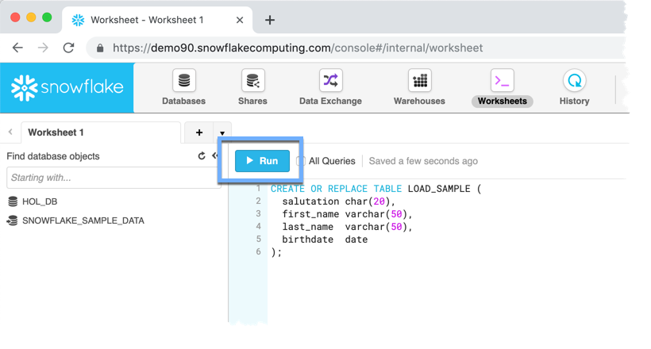
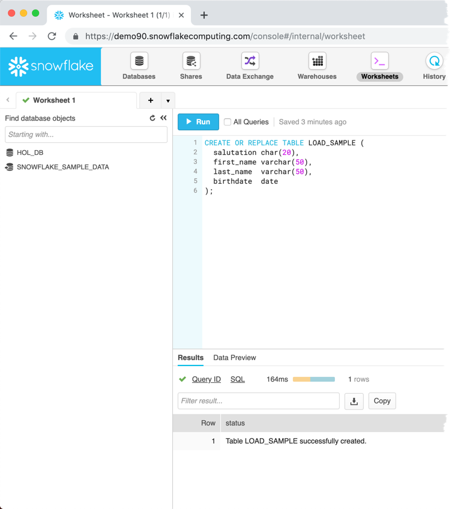
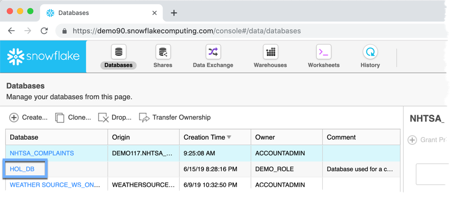
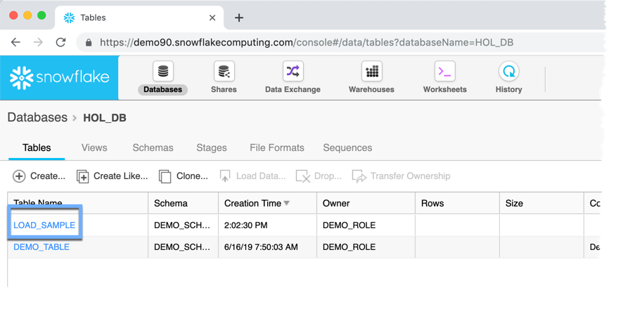
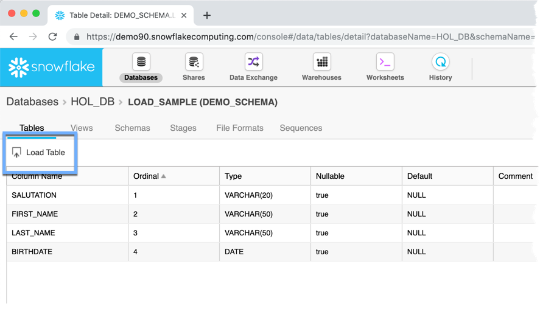
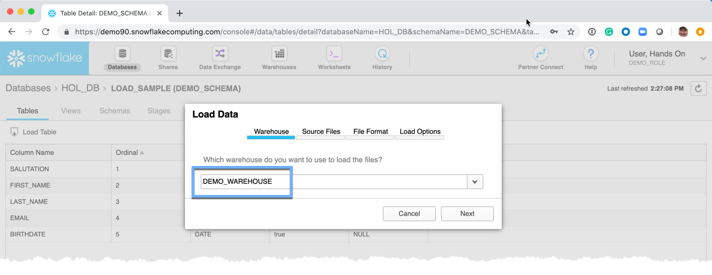
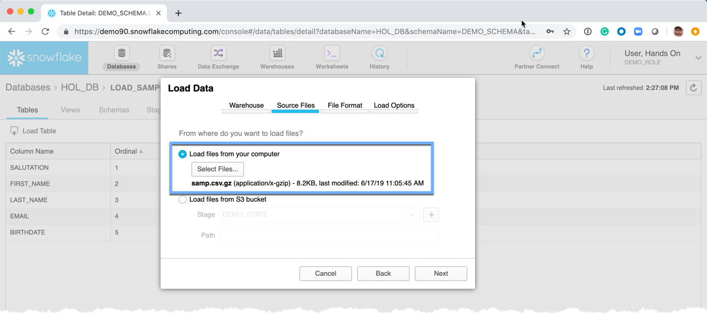
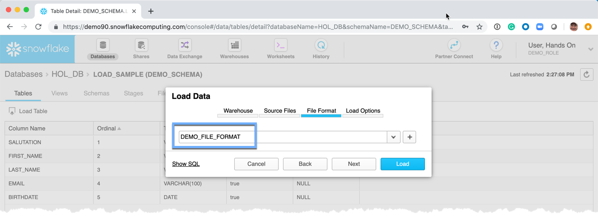
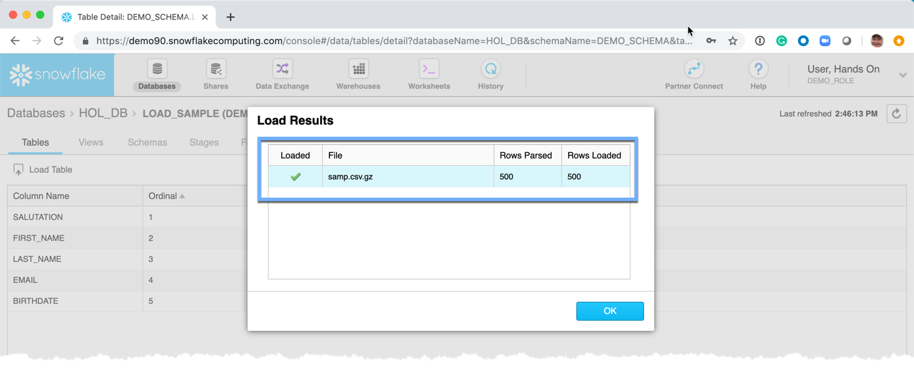
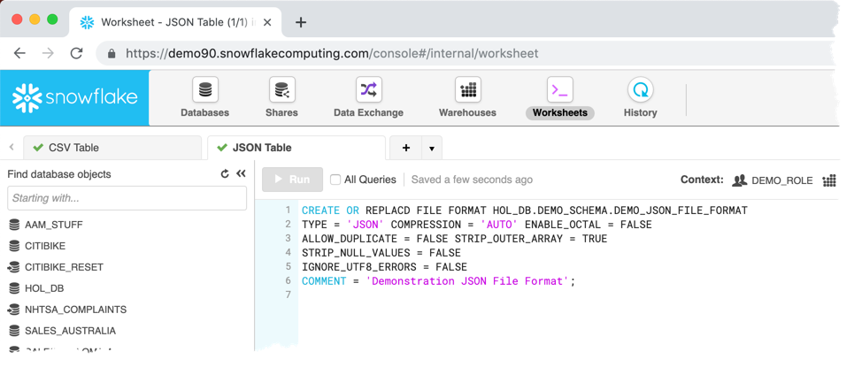

# Snowflake Data Loading

Snowflake handles loading [structured](#rectangle) and [semi-structured](#semi) data without the need for pre-processing or shredding.
 
<a name="rectangle"></a>
## Loading Rectangular Data

Snowflake has the ability to ingest data at very high speeds, both in batch mode and in near real-time.  This portion of the workshop is focusing on batch mode data ingestion.

### Ingest Data
1.  Obtain the [sample data](./data/samp.csv.gz)
1.  Copy the sample table DDL:
<a name="sample_ddl"></a>
```
CREATE OR REPLACE TABLE LOAD_SAMPLE (
  salutation char(20),
  first_name varchar(50),
  last_name  varchar(50),
  email      varchar(100),
  birthdate  date  
);
```
1.  Navigate to the *Worksheets* tab. (Further discussion of how to use the worksheet will occur in the Query section.


1.  Configure the current user context
    1.  Select the HOL_DB database
    1.  Select the DEMO_SCHEMA schema 


1.  Copy the [sample DDL](#sample_ddl) and paste into the worksheet


1.  *Run* the DDL by pressing the *Run* button.


1.  Verify the DDL ran correctly


1.  Navigate to the *Databases* page


1.  Select the *HOL_DB* database


1.  Select the *LOAD_SAMPLE* table


1.  Choose the *Load Tables* option


1.  The data loading wizard will appear.  Choose the warehouse which will process the ingestion request.  Choose *Next*.

  
1.  Select where the source file(s) are located.  Choose *Next*.


1.  Select the correct file format.  Choose **Load**.




<a name="semi"></a>
## Loading Semi-Structured Data

### Ingest Data
1.  Obtain the [sample data](./data/samp.json.gz)
1.  Command to create sample table DDL:
<a name="sample_json_ddl"></a>
```
CREATE OR REPLACE TABLE LOAD_JSON_SAMPLE (
  col1 variant
);
```

<a name="json_file_format></a>
1.  Command to create a JSON File Format
```
CREATE OR REPLACD FILE FORMAT HOL_DB.DEMO_SCHEMA.DEMO_JSON_FILE_FORMAT 
TYPE = 'JSON' COMPRESSION = 'AUTO' ENABLE_OCTAL = FALSE 
ALLOW_DUPLICATE = FALSE STRIP_OUTER_ARRAY = TRUE 
STRIP_NULL_VALUES = FALSE 
IGNORE_UTF8_ERRORS = FALSE 
COMMENT = 'Demonstration JSON File Format';
```
1.  Navigate to the *Worksheets* tab. (Further discussion of how to use the worksheet will occur in the Query section.


1.  Configure the current user context
    1.  Select the HOL_DB database
    1.  Select the DEMO_SCHEMA schema 


1. Copy and Run the [sample JSON command](#json_file_format), pasting it in the worksheet


1.  
