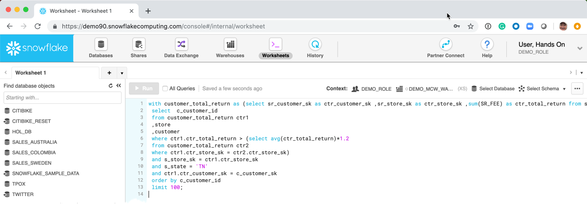
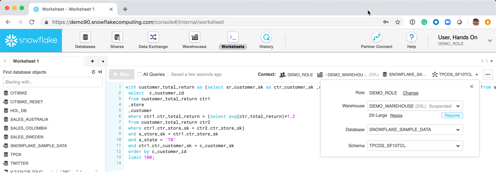
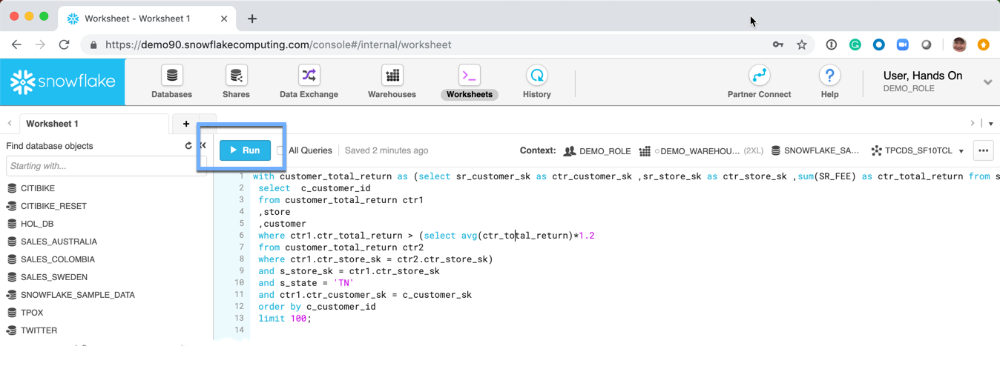
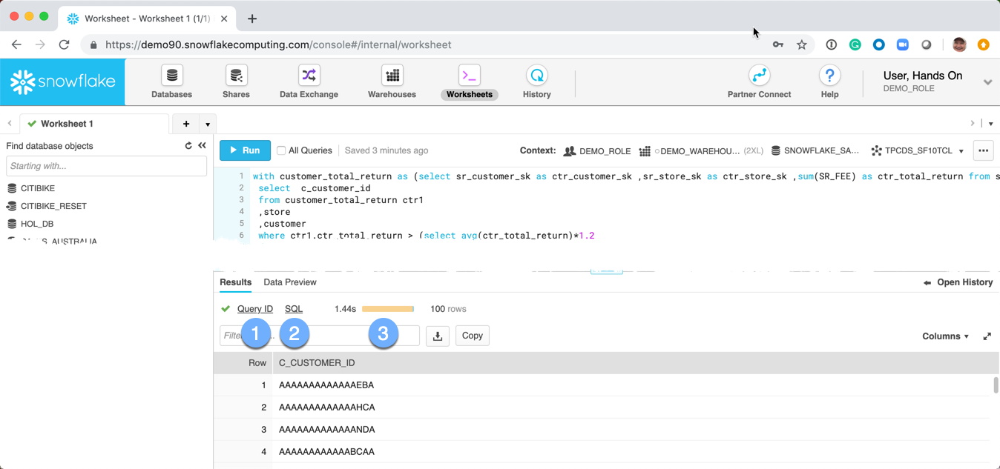
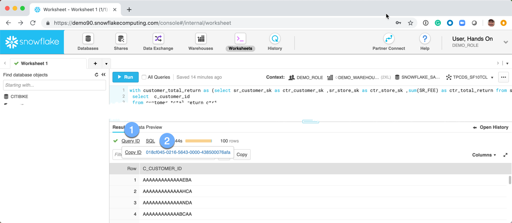
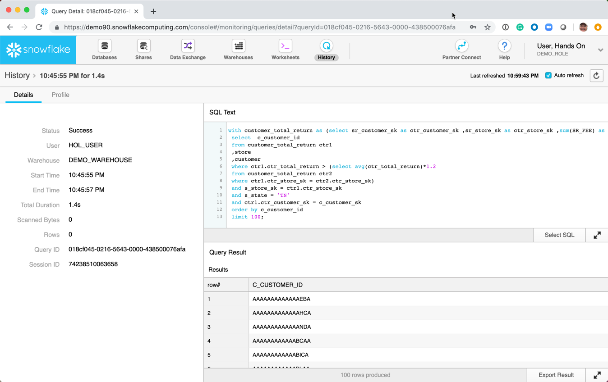
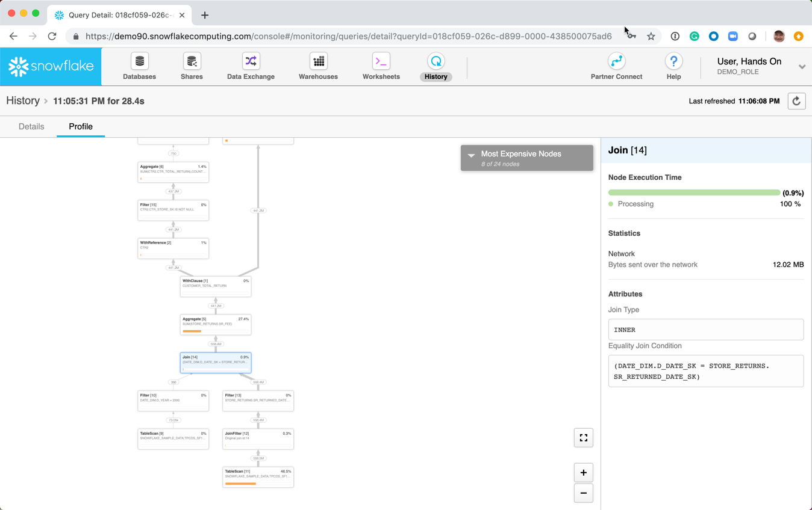

# Query Data

Snowflake support querying data via a wide variety of platforms:
-  Web UI
-  SnowSQL
-  JDBC
-  ODBC
-  Node
-  Spark Connector
-  R
-  Golang

The workshop will focus on running SQL from the Web UI.

1.  Navigate to the *Worksheets* tab

1.  Copy [sample query](./queries/query00.sql) and past into worksheet. 

1.  Set the proper user context
    -  **Role:** DEMO_ROLE
    -  **Warehouse:** DEMO_WAREHOUSE
    -  **Database:** SNOWFLAKE_SAMPLE_DATA
    -  **Schema:** TPCDS_SF10TCL

1.  Run the query

1.  Review the Results
    1.  Query ID - This is a unique key which identifies an SQL statement across the entire Snowflake deployment
    1.  SQL - Opens a dialogue box with the SQL that was executed
    1.  The duration of the query execution

1.  Examine the details of the query execution.
    1.  Click on *Query ID*
    1.  Click on the hyperlink of the Query ID

1.  The detals of the query are presented in the left frame.

1.  Select **Profile** to view the query profile

## Query History

The history for every query run can be found by choosing the **History** tab

A listing of all the history the user is authorized to view is presented.  Clicking on the *Query ID* navigates the user to the query details and profile page, as described [above](#query_details).

## [Query Semi-Structured Data](./Query-Semi-Structured.md)

[Return to Data Processing](../../Data-Processing.md)
